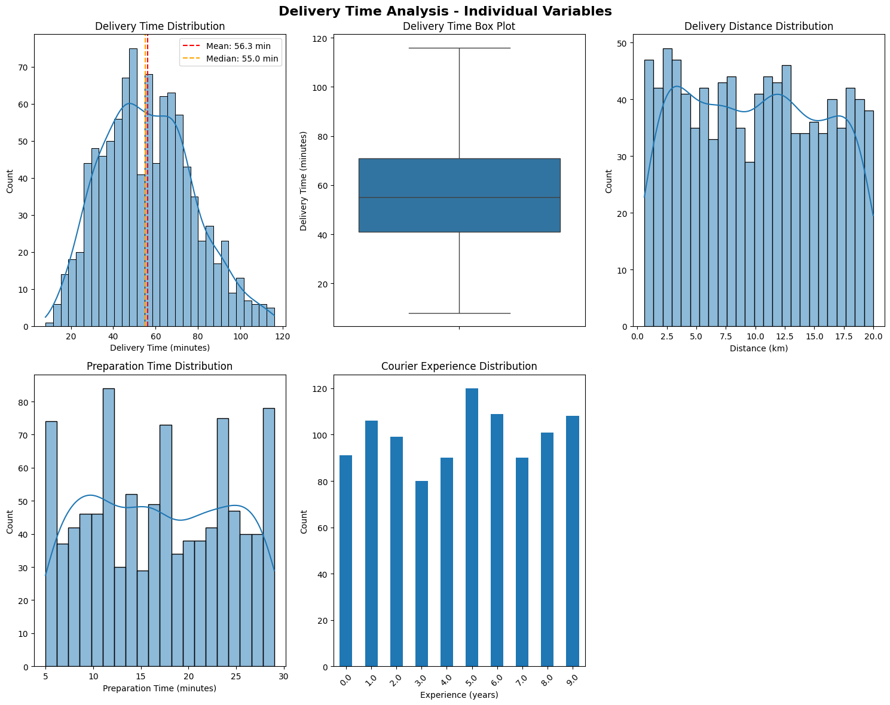
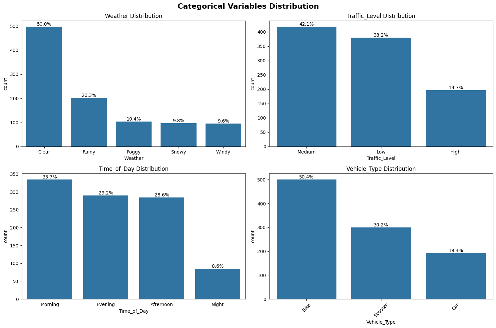

# EDA Report

_Key patterns, outliers, assumptions, and interpretations._

## 1) Structure & Sanity Checks
- Dataset has ~1k rows and 9 columns (post dropping ID).
- Types: mix of numeric (distance, prep time, courier experience, delivery time) and categoricals (weather, traffic, time of day, vehicle).
**Missingness (%):** minimal, concentrated in categoricals + courier experience.
- Duplicates: none.
_Interpretation: dataset is clean and balanced enough to proceed._
---
## 2) Feature & Target Distributions


- `Delivery_Time_min` ≈ unimodal, light right tail.
- `Distance_km` skewed right; most deliveries are short-distance.
- Categorical variables roughly balanced, with Bikes/Scooters dominant.
_ This target seems really appropiate for regression; distributions show no extreme imbalance._
---
## 3) Outliers (Tukey IQR)
- Outlier fences identified for `Delivery_Time_min`; ~0.6% rows removed.
_Interpretation: Removing extreme times reduces noise without losing generality._
---
## 4) Missing Values Handling
- Imputed categoricals with mode; `Courier_Experience_yrs` with median.
**Post‑imputation missing = 0.**
_Interpretation: Simple and safe strategy, avoids bias and preserves distributions._
---
## 5) Relationships & Correlations

- Strong positive correlation: `Distance_km` (~0.79) with delivery time.
- Moderate positive correlation: `Preparation_Time_min` (~0.31).
- Weak negative: `Courier_Experience_yrs` (−0.09).
**Crosstabs:** Weather × Traffic, Time × Vehicle, Time × Traffic show logical distributions (e.g., peak traffic at rush hours).
_Interpretation: Distance dominates, prep time matters, courier experience minor. Categorical effects visible but need formal tests._
---
## 6) How Categorical Factors Affect Delivery Time

- Plots show visibly higher delivery times under Rain/Storm and Heavy traffic.
- Time of day and vehicle type show weaker, less consistent differences.
_Interpretation: weather and traffic clearly impact delivery time; day-part and vehicle choice less decisive._
---
## 7) Statistical Significance Tests (ANOVA)
```
Weather: F=12.01, p<0.001 (Significant)
Traffic_Level: F=22.53, p<0.001 (Significant)
Time_of_Day: F=0.13, p=0.945 (Not Significant)
Vehicle_Type: F=0.48, p=0.620 (Not Significant)
```
- Weather and traffic **significantly** affect delivery time.
- Time of day and vehicle type show **no significant effect** after accounting for others.
_Interpretation: validates focusing on weather and traffic in modeling/ops._
---
## 8) Assumptions & Decisions
- Dropped ID features.
- Removed outliers in target (~0.6%).
- Imputed with safe, simple methods.
- One‑hot encoding planned for categoricals.
- Prioritize distance, prep time, weather, traffic as strong predictors.
---
## 9) Conclusions
- **Key drivers:** Distance and traffic are the strongest determinants of delivery time, with weather also significant. Prep time contributes but less strongly.
- **Non-drivers:** Courier experience is minor; vehicle type and time of day show no statistical significance.
- **Business insight:** Complaints about delays align with traffic/weather conditions, not with time of day or vehicle allocation.
- **Implication:** Ops team should focus on dynamic traffic/weather-aware ETAs rather than changing vehicle fleets or schedules.
- **Modeling:** Linear models will capture distance/prep, while tree-based methods may better capture traffic × weather interactions.
---