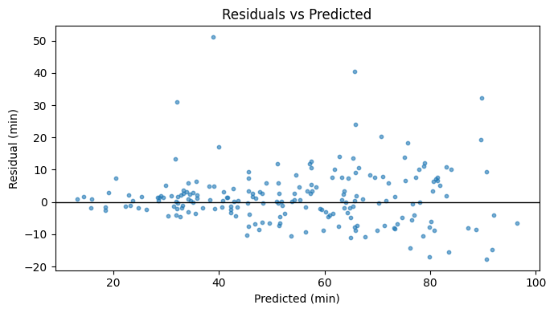

# Error Insights
_Insights on when and why the model fails._
## Overview
After some exploratory research of the traines model, the test set shows **RMSE ≈ 8.87 min**, **MAE ≈ 5.90 min**, and **R² ≈ 0.825**. This is consistent with a strong linear baseline and confirms most variance is explained.

## Residual behavior
The residuals are centered near zero but slightly right‑skewed, which indicates the model **underestimates** some late deliveries. Variance grows with predicted time, hinting at larger spread for longer trips. These two patterns are common in ETA problems and align with our EDA.

**What this means:** when trips are longer or conditions degrade, the true time can overshoot the prediction. In practice this shows up as occasional underestimation pockets and here is where this model has some trouble but mostly under extreme conditions.

## Error clusters
Slice analysis by **Weather**, **Traffic_Level**, and **Distance bins** shows the expected: heavier traffic and rainy/stormy weather increase error magnitude and shift the mean residual upward (positive residual = prediction too low). Long‑distance bins also have higher RMSE. These effects compound; the worst cases are **long distance + heavy traffic**, and they are the main source of late‑ETA underestimates.

**Why this happens:** the deployed baseline is additive(what makes this scenario trickier); it captures shifts (traffic/weather) and a near‑linear distance effect, but it does not yet model the **interaction** where distance “costs more minutes” under congestion/rain. That interaction creates a "super‑linear tail" the linear model cannot fully absorb yet.

## Feature signals behind the errors
Permutation importance confirms **Distance_km** dominates, with **Traffic_Level** and **Weather** providing meaningful offsets and **Preparation_Time_min** contributing moderately. **Courier_Experience_yrs** has a small negative effect but is despreciable in my opinion for this particular case.

## What to change (targeted, low‑risk)
First, i'll add **Distance×Traffic** and **Distance×Weather** features to the linear family; this usually reduces underestimation for “long & congested” slices without making the model opaque. Second, produce a **conservative ETA** for risky contexts by training a **quantile regression (e.g., τ=0.75 or 0.9)** or by applying a small, data‑driven buffer when `Traffic=Heavy` and `Weather∈{Rain,Storm}`. Keep the slice dashboard (weather/traffic/distance) and track mean residual and RMSE per slice daily.

## Conclusions
Overall accuracy is solid (RMSE ≈ 8.87, R² ≈ 0.825), and the model behaves sensibly. The remaining failures are **predictable and bounded**: underestimates concentrate in **rainy/heavy traffic** and **long‑distance** deliveries. By introducing a couple of interaction terms (and/or a quantile head for adverse contexts), we can reduce those late‑ETA pockets while preserving the model’s simplicity and explainability. But it is still a good enough approach for the type of bussines conducted, especially if we refer to our `avg_delivery_time vs customer_rating`
